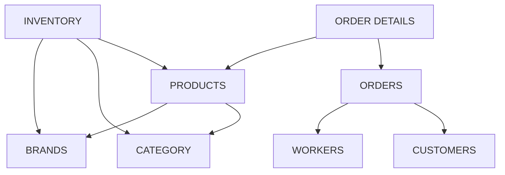

# SQL PROJECT: construyendo y analizando el dataset de un e-commerce

Este proyecto simula la base de datos de una plataforma de e-commerce que opera en tres países: Reino Unido, Irlanda y Canadá. El objetivo es analizar su contenido para obtener insights sobre rendimiento del negocio en base a una serie de preguntas preestablecidas.

## Estructura del Proyecto
```text
f1_showcase_project/
    data/
        base_data/
            basket_products.csv
            nyc_marathon_results.csv
        raw_data/
            br_data.csv
            ca_data.csv
            cu_data.csv
            de_data.csv
            in_data.csv
            or_data.csv
            pr_data.csv
            wo_data.csv
    sql/
        01_schema.sql
        02_load_staging.sql
        03_transform_core.sql
        04_quality_checks.sql
        05_semantic_queries.sql
        06_analysis_queries.sql
        07_simulation_procedures.sql
    src/
        __init__.py
        data_creation.py
        data_validation.py
        io.py
        utils.py
    main.py
    README.md
    PYTHON_EXPLAINED.md
    requirements.txt
```

## Dataset
Trabajaremos con un dataset sintético que simula la evolución de un e-commerce. Está diseñado de forma que refleje el crecimiento del negocio desde su apertura en UK en 2015, pasando por su expansión a Irlanda (2017) y Canadá (2020), hasta la fecha actual. 

Contiene datos dimensionales tanto de productos y marcas como de clientes y trabajadores de cada país, además de datos transaccionales de las reposiciones de inventario, pedidos y detalles sobre los productos comprados en cada pedido. 

Una descripción detallada de su creación se encuentra en [PYTHON_EXPLAINED.md](PYTHON_EXPLAINED.md). Para el análisis se usará MySQL.

Los datos a partir de los cuales se ha construido el dataset provienen de:

* **Productos, categorías, marcas y precios:** [BigBasket Entire Product List](https://www.kaggle.com/datasets/surajjha101/bigbasket-entire-product-list-28k-datapoints)

* **Nombres de clientes y trabajadores:** [NYC Marathon Results](https://www.kaggle.com/datasets/runningwithrock/nyc-marathon-results-all-years)

A continuación se especifican las características de las tablas del dataset final:

* **Products (`pr_data.csv`):** 494 filas; 7 columnas. 
    * *Variables clave:* product_id, product_name, product_price.
* **Categories (`ca_data.csv`):** 11 filas; 2 columnas. 
    * *Variables clave:* category_id, category.
* **Brands (`br_data.csv`):** 343 filas; 2 columnas. 
    * *Variables clave:* brand_id, brand.
* **Inventary (`in_data.csv`):** 494 filas; 6 columnas. 
    * *Variables clave:* product_id, stock, last_restock.
* **Customers (`cu_data.csv`):** 8970 filas; 8 columnas. 
    * *Variables clave:* customer_id, country, subscription_date.
* **Workers (`wo_data.csv`):** 500 filas; 9 columnas. 
    * *Variables clave:* worker_id, country, hired_date, hours_day, salary_day.
* **Orders (`or_data.csv`):** 50000 filas; 6 columnas. 
    * *Variables clave:* order_id, customer_id, worker_id, order_date, total_paid.
* **Order Details (`de_data.csv`):**  423918 filas; 6 columnas. 
    * *Variables clave:* detail_id, order_id, product_id, quantity, total_price.  

<br>



</br>


## Línea de Análisis: Evolución del Comercio por País

El negocio online opera en tres países: Reino Unido, Irlanda y Canadá. Queremos estudiar y comparar su evolución en cada país para buscar similitudes y posibles diferenciaciones.

El análisis se centrará en tres grupos de preguntas:

* **Ventas por país. Evolución y comportamiento:** se pretende analizar cómo se distribuyen las ventas entre los distintos países y cómo evoluciona la actividad comercial en cada mercado. Esto permite identificar mercados más activos, patrones temporales de compra y posibles diferencias en el comportamiento del consumidor. Algunas preguntas clave son:
    * ¿Qué países generan **mayor volumen de ventas** y cuál es su **contribución al total**?
    * ¿Existen **diferencias en el valor medio de los pedidos** entre países?
* **Productos por país. Aceptación del producto y consumo:** se exploran qué productos tienen mayor aceptación en cada mercado y si existen diferencias en las preferencias de consumo entre países. Algunas preguntas claves son:
    * ¿Cuáles son los **productos más vendidos** globalmente?
    * ¿Cambian las **preferencias de producto según el país**?
    * ¿Qué **categorías generan más ingresos**?
* **Factor humano. Clientes y trabajadores:** se analizan los hábitos de consumo de los clientes y la actividad de los trabajadores implicados en la gestión de pedidos. Algunas preguntas claves son:
    * ¿Cuál es la **frecuencia de compra** de los clientes?
    * ¿Existen **clientes con alto volumen de pedidos**?
    * ¿Existen **trabajadores con mayor carga de actividad**?
    * ¿Hay diferencias en la **actividad por país**?


## Arquitectura de datos

El proyecto implementa una arquitectura de datos en tres capas: staging, core y semantic, que permite separar la ingestión de datos, la transformación y el análisis final.

### Staging Layer (`01_schema.sql` y `02_load_staging.sql`)

Se crea la base de datos *sql_project* en MySQL. Posteriormente se eliminan y crean las tablas de staging donde se importarán los datos raw desde los .csv como cadenas de caracteres, además de eliminar y crear las tablas de datos dimensionales y transaccionales.

Antes de pasar a poblar estas tablas se llevan a cabo checks de volumen y parsability para confirmar la integridad de los datos.

### Core Layer (`03_transform_core.sql` y `04_quality_checks.sql`)

Se define un procedure (*sp_refresh_core*) que permite poblar las tablas una a una y guardar el progreso en snapshots que diferencian el almacenado en etapas y funcionan como puntos de control. También guarda sus nuevas dimensiones para presentarlas al final del proceso a modo de sanity check.

A la hora de transformar e insertar los datos desde las tablas de staging se aplica la función NULLIF a los campos que se han definido como NOT NULL para provocar un fallo en caso de que uno de los valores esté vacío.

Se verifica la calidad de los datos mediante la búsqueda de nulos, claves foráneas huérfanas, entradas duplicadas en las tablas transaccionales, rango de fechas (se busca coincidencia con las fechas de ampliación del negocio), métricas no válidas (nulas o negativas) y nombres de países incorrectos.

### Semantic Layer (`05_semantic_views.sql`)

Se amplía la información de las tablas dimensionales principales para el análisis (*dim_products*, *dim_customers* y *dim_workers*):

* *vw_products_enriched*: se añaden nombres de categorías y marcas, stock y fecha de restock desde *fct_inventory*, total de unidades compradas y las ganancias.

* *vw_customers_enriched*: se añade un campo con el nombre completo (que sustituye a *first_name* y *last_name*), edad, total de compras, total de gasto y total de productos comprados.

* *vw_workers_enriched*: se añade un campo con el nombre completo (que sustituye a *first_name* y *last_name*), edad, sueldo mensual y total de pedidos preparados.

Se crean las siguientes KPIs:

* *vw_countries_kpi*: se incluye el total de pedidos, productos comprados, ganancias, total de clientes y trabajadores, media de pedidos por cliente, media de productos comprados por pedido y media de ganancia por pedido por país y año.

* *vw_categories_kpi*: total de productos por categoría, precio medio, stock promedio, total de productos comprados y total de ganancias por categoría.

* *vw_brands_kpi*: similar a *vw_categories_kpi*.

## Análisis 

A continuación se muestran las conclusiones obtenidas de las vistas calculadas en `06_analysis_queries.sql`.

### Ventas por país. Evolución y comportamiento

El comercio cuenta con un total de 423.918 pedidos realizados y las ganancias ascienden a 22,7M€, con una media de 53,66€ ganados por pedido. El mercado canadiense supone el 41,93% del mercado total (177.752 pedidos en total y 25.393 de media por año), con una ganancia total de 9,4M€ (y media de 1,37M€ por año). Le siguen Reino Unido con un 41,21% de aportación al total de pedidos e Irlanda con un 16,86%. Sabiendo que el comercio no empezó a operar en Canadá hasta 2020, los datos indican que ha sido el mercado con mayor crecimiento desde su inicio, llegando a superar en 6 sólo años a los mercados de Reino Unido e Irlanda de 11 y 9 años respectivamente.

La diferencia media de ganancias por pedido oscila entre los 45€ y 60€ con una variabilidad de aproximadamente 1,23€ para Irlanda y Canadá, y de casi 2€ para Reino Unido, que además tiene en promedio los pedidos más baratos (de 53,36€ frente a los 53,51€ Irlanda y 54€ de Canadá).

Podemos concluir entonces que el mercado más rentable y con mayor crecimiento actualmente es Canadá, teniendo tanto las mayores ganancias absolutas y medias como el mayor número de pedidos de los tres mercados. Dado que el ticket medio es casi homogéneo entre países, las diferencias de rendimiento se explican principalmente por el volumen de pedidos y la frecuencia de compra, no por el precio. Esto sugiere que el éxito en Canadá se debe a un mayor dinamismo del mercado y posiciona al país como la principal oportunidad de crecimiento para el negocio.

### Productos por país. Aceptación del producto y consumo

Los productos más populares son todos de la categoría 'Fruits & Vegetables', con precios que no superan los 0,50€ por unidad. El más popular,  'Drumstick - Organically Grown', se ha comprado un total de 5.303 unidades y ha proporcionado una ganancia de 862,49€. Otros productos, como 'Pomegranate - Single Serve', 'Banana - Red' o 'Zucchini - Green', se han vendido en hasta 500 unidades menos pero han aportado unas ganancias de entre 2.000 y 3.000, hasta un 28,75% más.

Las categorías más populares son 'Beauty & Hygiene', 'Kitchen, Garden & Pets' y 'Gourmet & World Food'. Parece que 'Fruits & Vegetables' es una de las menos populares a pesar de tener los productos más comprados. Podemos asumir que el resto de categorías ofertan más productos aunque se compran individualmente mientras que los de 'Fruits & Vegetables' se compran en grupo. Al calcular las mismas métricas para las marcas, vemos que son marcas de 'Fruits & Vegetables', como 'Fresho', 'Sunfeast' o 'Amul', las más populares pero las que más ganancias generan son las de 'Beauty & Hygiene', como 'Ajmul', 'Prestige' o 'Cello', confirmando la hipótesis anterior.

Los 5 productos más populares por país son, en general, los mismos. Vemos como en Reino Unido y especialmente en Irlanda se consume 'Coriander Leaves 100 g + Garlic 250 g + Ginger 250 g + Chilli Green Long 250 g'. 'Drumstick - Organically Grown' se coloca como el favorito en los tres países aunque con una diferencia menor a 100 unidades vendidas con respecto al siguiente producto. La conclusión directa es que no hay diferenciación de mercado por países a nivel de producto.

### Factor humano. Clientes y trabajadores

Si agrupamos los clientes por ciudad no vemos diferencias notorias. El total de pedidos se mueve entre los 33.000 y 40.000, siendo Londres la ciudad con menos pedidos (32.894 pedidos y 1,7M€) y Dublín la que más (3.6726 pedidos y 1,9M€). Es notorio ver que el mercado canadiense se ajusta tanto a los estándares de, por ejemplo, el inglés, teniendo en cuenta que es el último en empezar a operar con diferencia. De hecho, la mayoría de clientes con mayor volumen de compras son canadienses, siendo los dos clientes con más pedidos Yann Borgne y Juan Moyano, ambos suscritos en 2025 y con más de 140 pedidos realizados y 8M€ gastados. 

La frecuencia de compra de los clientes es una sorpresa. Vemos como hay clientes que llegan a dejar pasar hasta casi 300 días de media sin comprar. El mercado más activo vuelve a ser el canadiense, con una media de una compra cada 138 días. El mercado inglés parece ser bastante más lento, llegando a pasar de media 284 días sin compras, habiendo un total de hasta 3.188 días entre compra y compra, más de 1.500 en comparación a Canadá. 

Los datos indican que las diferencias en el rendimiento del negocio no se explican por el perfil del cliente, sino por su comportamiento de compra. En este sentido, Canadá destaca claramente por una mayor frecuencia de compra y concentración de clientes, lo que impulsa su crecimiento frente a mercados como Reino Unido, donde la recurrencia es significativamente menor. Además, el aumento de la carga de trabajo en empleados recientes, especialmente en Canadá, refuerza la idea de que este mercado está en plena fase de expansión y demanda una mayor capacidad operativa.

## Conclusiones y Estrategias a Futuro

Los datos vistos durante el análisis nos llevan a las siguientes conclusiones:

* **Canadá es un motor clave:** es el mercado más rentable y dinámico; su crecimiento rápido lo convierte en la principal oportunidad de expansión. Sería conveniente priorizar inversión y campañas de marketing en Canadá para aumentar frecuencia y explotar el mercado al máximo, además de explorar la posible expansión de categorías rentables y productos de alto margen.

* **Reino Unido e Irlanda se estancan:** su menor frecuencia de compra y volumen limita la rentabilidad; conviene evaluar si reactivarlos, por ejemplo con estrategias de engagement eficaces, vale la inversión.

* **Engagement del cliente:** Reducir el tiempo entre compras es crítico para aumentar ingresos y fidelización en todos los mercados. Deben implementarse programas de fidelización y promociones para disminuir el espacio entre compras. También es importante mejorar la logística y capacidad operativa en mercados en crecimiento para sostener la demanda, particularmente en Canadá.

## Extra: simulación de nueva order (`07_simulation_procedures.sql`)

En este archivo se definen una serie de procedures que registran un nuevo pedido de un usuario dado y actualizan las tablas *fct_orders*, *fct_order_details* y *fct_inventory*. A continuación se describen las partes del archivo:

* `fn_next_id`: función que genera el siguiente ID correlativo dado un prefijo y el último ID existente. Extrae el número del string, le suma 1 y reconstruye el formato original con padding de ceros.

* `tr_update_stock`: trigger que se dispara automáticamente tras cada inserción en *fct_order_details*. Descuenta del stock en *fct_inventory* la cantidad comprada de cada producto sin necesidad de llamarlo explícitamente.

* `sp_adding_product_to_cart`: procedure que valida y añade un producto a la tabla temporal *tmp_order_items*. Comprueba que el producto existe, está activo, la cantidad es válida y hay stock suficiente antes de insertar.

* `sp_adding_new_order`: procedure que construye una orden completa a partir de  *tmp_order_items*. Valida que el cliente existe, asigna automáticamente el trabajador menos cargado del mismo país, genera los IDs de orden y detalles, e inserta en fct_orders y fct_order_details dentro de una transacción. El trigger se encarga del stock automáticamente. Al finalizar destruye la tabla temporal.

Incluye un ejemplo que pone en práctica lo que se pretende con este archivo.

## Replicación del proyecto

* Ejecutar archivo `01_schema.sql` e importar los datos manualmente a las tablas de staging usando los .csv de `raw_data`.

* Ejecutar archivo `03_transform_core.sql` para insertar datos en las tablas de dimensión y transacción.

* Por seguridad, ejecutar archivos  `02_load_staging.sql` y `03_quality_checks.sql` después de cada paso para validar datos.
